# CLAUDE.md — Client Onboarding Workflow

> **Language:** Python (3.10+)
> **Client:** Priya R., Account Director — Halo Brand Studio
> **Budget:** $3,000–5,500 | **Timeline:** 2–3 weeks

---

## 1. Project Overview

Every new client onboarding at Halo takes the team **4–6 hours over the first week**:

- Sending welcome emails
- Collecting brand assets
- Setting up project tools
- Scheduling kickoff calls
- Drafting the project brief from their answers
- Creating the Slack channel and ClickUp project

The same process every time, and steps get forgotten. We are building an agent that **runs the entire onboarding workflow automatically the moment a contract is signed**, with account managers **reviewing and approving each milestone** instead of executing it.

---

## 2. Required Features

| # | Feature | Notes |
|---|---------|-------|
| 1 | Triggers on signed contract (DocuSign or PandaDoc webhook) | Two e-sign providers |
| 2 | Sends welcome email with onboarding questionnaire (Typeform or Tally) | Configurable form provider |
| 3 | Books kickoff call automatically via Calendly | Integration |
| 4 | Creates ClickUp project from template with correct phases and milestones | Per-service-type template |
| 5 | Creates Slack channel and invites client team | Naming convention |
| 6 | Creates shared Google Drive folder with standard structure | Folder template |
| 7 | Drafts project brief from questionnaire responses for AM review | Halo's voice |
| 8 | Sends checklist reminders to client if assets/info missing after 3 days | Polite |

---

## 3. Important Constraints

- **Account manager reviews and approves each milestone before client sees it.** Nothing auto-fires externally without approval.
- **All external client emails drafted, never auto-sent.** Internal automation (Slack channel, ClickUp project, Drive folder) can run; external comms cannot.
- **Must work even if client doesn't fill out questionnaire** — degrade gracefully, AM can fill it in.
- **Project brief must be in our agency's voice, not robotic.**
- **Must handle retainer renewals differently from new client onboardings.** Renewal flow is shorter — no welcome email, no kickoff call needed, just refresh setup.

---

## 4. Tech Stack

```
Python 3.10+    |   DocuSign / PandaDoc webhooks
Typeform API    |   Calendly API         |   ClickUp API
Slack API       |   Google Drive API     |   Claude API
```

---

## 5. Architecture

```
   ┌─────────────────────────────────────────────────────────┐
   │            E-SIGN WEBHOOK                                │
   │   DocuSign OR PandaDoc → "envelope_completed" event      │
   └─────────────────────────────────────────────────────────┘
                            │
                            ▼
   ┌─────────────────────────────────────────────────────────┐
   │            ONBOARDING ROUTER                             │
   │  - Inspect contract metadata                             │
   │  - Is this a new client OR a retainer renewal?           │
   │      ▸ new       → full flow                             │
   │      ▸ renewal   → renewal flow (skip welcome/kickoff)   │
   └─────────────────────────────────────────────────────────┘
                            │
        ┌───────────────────┴────────────────────┐
        │                                        │
   NEW CLIENT FLOW                          RENEWAL FLOW
        │                                        │
        ▼                                        ▼
   ┌─────────────────────────┐    ┌────────────────────────────┐
   │ MILESTONE 1: Welcome    │    │ MILESTONE R1: Refresh setup│
   │ - Draft welcome email + │    │ - Update ClickUp dates     │
   │   questionnaire link    │    │ - Refresh Drive folder     │
   │ - AM review queue       │    │ - Slack: notify team       │
   └─────────────────────────┘    └────────────────────────────┘
        │ (AM approves & sends)
        ▼
   ┌─────────────────────────┐
   │ MILESTONE 2: Internal   │
   │ setup (no client view)  │
   │ - Slack channel         │
   │ - ClickUp project from  │
   │   service-type template │
   │ - Drive folder w/ std   │
   │   structure             │
   └─────────────────────────┘
        │
        ▼
   ┌─────────────────────────┐
   │ MILESTONE 3: Kickoff    │
   │ booking                 │
   │ - Calendly link drafted │
   │ - AM sends in welcome   │
   │   email or reviews      │
   │   booking flow          │
   └─────────────────────────┘
        │
        ▼
   ┌─────────────────────────┐
   │ MILESTONE 4: Brief draft│
   │ (after questionnaire    │
   │  returns OR T+3d        │
   │  reminder + degrade)    │
   │ - Pull Typeform answers │
   │ - Claude drafts brief   │
   │   in Halo voice         │
   │ - AM reviews            │
   └─────────────────────────┘
        │
        ▼
   ┌─────────────────────────┐
   │ MILESTONE 5: Reminder   │
   │ - If assets/info        │
   │   missing after 3 days  │
   │   → polite checklist    │
   │   reminder (drafted     │
   │   for AM approval)      │
   └─────────────────────────┘
```

---

## 6. Development Workflow

```
┌──────────────────────────────────────────────────────────────┐
│                  DEVELOPMENT WORKFLOW                        │
└──────────────────────────────────────────────────────────────┘

  STEP 1 — PLAN
    • Read this CLAUDE.md fully before writing code
    • Pick ONE milestone to build first (suggest: internal setup
      — fewest external dependencies, easiest to test)
    • Document the new-vs-renewal branching rules with Priya
      BEFORE coding the router

  STEP 2 — IMPLEMENT (Python)
    • All secrets via environment variables (.env + dotenv)
    • Each milestone is an independent module with a clear
      "ready / running / awaiting_approval / done / failed"
      state
    • Pydantic schemas for OnboardingRun, Milestone, AMReview
    • Log every milestone transition with run_id, milestone,
      old_state, new_state
    • Wrap every API call in try/except with specific exceptions
    • External-comms milestones queue drafts; AM approval is
      the only trigger to send

  STEP 3 — RUN THE SCRIPT
    • Test against a sandbox of all integrated tools (DocuSign
      demo, sandbox ClickUp workspace, test Slack workspace)
    • Run a NEW client onboarding end-to-end
    • Run a RENEWAL flow end-to-end
    • Run a flow where the questionnaire is never filled →
      verify graceful degrade after 3 days
    • Verify: every external client email is a draft, AM-gated
    • Verify: internal setup (Slack/ClickUp/Drive) completes
      without manual intervention

  STEP 4 — IF YOU HIT AN ERROR ────────────────────────────────
    │
    │  4a. READ THE FULL ERROR MESSAGE AND TRACEBACK
    │      ─ Do NOT skip lines
    │      ─ Read every line of the traceback, top to bottom
    │      ─ Identify:
    │           • Exact file and line number
    │           • Exception type
    │           • The actual value that caused the failure
    │      ─ For webhook errors: log envelope_id, sender,
    │        verified signature, payload
    │      ─ For ClickUp/Slack/Drive errors: log the operation,
    │        target id, and response JSON
    │      ─ For Claude errors: log the full prompt and raw
    │        response
    │      ─ For state machine errors: log run_id and milestone
    │        state history
    │
    │  4b. FIX THE SCRIPT
    │      ─ Find the root cause — do NOT guess
    │      ─ Re-read the function being edited end to end
    │      ─ Make the smallest possible targeted fix
    │      ─ Critical: never let an external client email send
    │        without AM approval
    │      ─ Critical: never partially create infrastructure
    │        (e.g. Slack channel without ClickUp project) and
    │        leave the run stuck — each milestone must be
    │        idempotent so re-running picks up where it left off
    │      ─ Critical: renewal flow must NOT trigger welcome
    │        email under any circumstance
    │
    │  4c. RETEST
    │      ─ Re-run the full pipeline, not just the failing step
    │      ─ Confirm the original error is gone
    │      ─ Run edge cases:
    │           • Renewal contract that resembles a new contract
    │             (router must classify correctly — confirm rule)
    │           • Client never fills questionnaire → after 3
    │             days, brief drafter falls back to "draft with
    │             AM-provided info" mode
    │           • Slack channel name collision (existing channel)
    │             → append suffix, log, continue
    │           • ClickUp template missing → fail loud, don't
    │             create an empty project
    │           • Network error mid-flow → re-run resumes from
    │             last successful milestone, no duplicate
    │             channels/projects
    │      ─ Verify NO external client email sent without AM
    │
    │  4d. DOCUMENT WHAT YOU LEARNED
    │      ─ Append an entry to the "## Error Log" section below
    │      ─ Use the template provided
    │      ─ Mark [SAFETY] / [IDEMPOTENCY] / [RENEWAL] /
    │        [DEGRADE]
    │
    └─────────────────────────────────────────────────────────

  STEP 5 — VALIDATE OUTPUT
    • New vs renewal flows correctly distinguished
    • External client emails all drafts, all AM-gated
    • Internal infrastructure (Slack/ClickUp/Drive) created
      automatically with standard structure
    • Questionnaire-less clients degrade gracefully
    • Brief reads in Halo's voice (spot-check)
    • Re-run is idempotent — no duplicate channels/projects

  STEP 6 — GENERATE README.md
    • See section "## 8. README.md Requirements" below
```

---

## 7. Error Log

### Entry Template

```
### [YYYY-MM-DD] — [short title]

**Error Type:**

**Full Error Message:**
\```
Last 5–10 lines of traceback verbatim.
\```

**What I Was Doing:**

**Root Cause:**

**Fix Applied:**

**Lesson Learned:**
Mark [SAFETY] / [IDEMPOTENCY] / [RENEWAL] / [DEGRADE].
```

### [2026-05-17] — Renewal flow crashed: no ClickUp template for service_type=retainer

**Error Type:** `src.integrations.base.TemplateMissingError`

**Full Error Message:**
```
src\milestones\renewal.py:31: in run
    clickup_artifact = run_idempotent(
src\state\idempotency.py:68: in run_idempotent
    result = fn()
src\milestones\renewal.py:68: in _refresh_clickup
    project = clients.clickup.create_project(
src\integrations\clickup.py:66: in create_project
    template = self.load_template(service_type)
src\integrations\clickup.py:49: in _load_template
    raise TemplateMissingError(
E   src.integrations.base.TemplateMissingError: no ClickUp template configured for service_type='retainer' (expected .../config/service_templates/retainer.yaml)
```

**What I Was Doing:** First end-to-end pytest run. Four renewal-path tests failed at `internal_setup`/`renewal_refresh` because the renewal flow always pins `service_type=retainer` but I had only shipped templates for `branding`, `web`, and `campaign`.

**Root Cause:** Renewal contracts use `ServiceType.RETAINER`. The `MockClickUpClient.load_template()` lookup is keyed by service-type string, and there was no `config/service_templates/retainer.yaml`. The "fail loud on missing template" guard correctly tripped — there was no actual missing-template scenario in production, it was a genuine config gap.

**Fix Applied:** Added [`config/service_templates/retainer.yaml`](config/service_templates/retainer.yaml) with retainer-appropriate phases ("This month", "Reporting") and Drive folders (`00_Retainer_Agreements`, `01_Monthly_Briefs`, ...). Verified all four renewal tests pass.

**Lesson Learned:** [RENEWAL] The classifier output and the template registry are coupled — every value in `ServiceType` must have a matching template file, or the milestone that consumes it crashes loud. Adding a new service-type means adding both the enum value AND a `config/service_templates/<value>.yaml`. Documented in README §Service-type templates.

### [2026-05-17] — Test stale after adding retainer.yaml

**Error Type:** Test assertion / design

**Full Error Message:**
```
test_missing_clickup_template_fails_loud previously used ServiceType.RETAINER
to force the "missing template" path; that path no longer exists because
retainer.yaml now resolves successfully.
```

**What I Was Doing:** After fixing the RENEWAL bug above, the deliberately-failing test stopped exercising the failure path — it now succeeded, which silently weakens the regression suite.

**Root Cause:** I had encoded the "missing template" scenario by picking a `ServiceType` value that happened to have no template on disk. That's fragile — fixing the config gap removes the test's reason to exist.

**Fix Applied:** Rewrote the test in [`tests/test_internal_setup_edges.py`](tests/test_internal_setup_edges.py) to use `monkeypatch` on `MockClickUpClient.load_template` to inject a `TemplateMissingError` directly. The failure path is now tested by behaviour, not by config absence.

**Lesson Learned:** [SAFETY] Tests for "fail loud" branches should inject the failure with monkeypatching, not rely on the config-on-disk being in a particular state. Otherwise fixing real config gaps quietly mutes the test.

### [2026-05-17] — Mypy union-attr errors on Anthropic content blocks

**Error Type:** `mypy` `[union-attr]`

**Full Error Message:**
```
src\drafter\claude_client.py:52: error: Item "ThinkingBlock" of
"TextBlock | ThinkingBlock | RedactedThinkingBlock | ToolUseBlock | ...
<11 variants>" has no attribute "text"  [union-attr]
```

**What I Was Doing:** Running mypy after the test suite went green. The Claude wrapper extracted text from `response.content` blocks using `block.text`, but `Message.content` is a union of ~13 block types and only `TextBlock` exposes `.text`.

**Root Cause:** Naively walking the union — `getattr(block, "type", None) == "text"` is a runtime check that mypy can't narrow.

**Fix Applied:** Switched to `getattr(block, "text", None)` + `isinstance(text, str)` in [`src/drafter/claude_client.py`](src/drafter/claude_client.py). Behaviour is the same; mypy can now narrow.

**Lesson Learned:** Type-narrowing across heterogeneous-union SDK types is easier with `getattr` + `isinstance` than with `.type` discrimination. Not a [SAFETY/IDEMPOTENCY/RENEWAL/DEGRADE] tag — pure typing.

### [2026-05-17] — Pydantic EmailStr import failure

**Error Type:** `ImportError`

**Full Error Message:**
```
.venv\Lib\site-packages\pydantic\networks.py:968: in import_email_validator
    raise ImportError("email-validator is not installed, run
    `pip install 'pydantic[email]'`") from e
```

**What I Was Doing:** First test-collection pass. Schemas use `EmailStr` for `ClientContact.email`, `Draft.recipients`, and AM-review reviewer addresses. Without the optional `email-validator` extra, Pydantic refuses to build the model.

**Root Cause:** Listed `pydantic` as a dep without the `[email]` extra, even though our schemas depend on it.

**Fix Applied:** Updated `requirements.txt` and `pyproject.toml` to specify `pydantic[email]>=2.6`. Verified imports succeed.

**Lesson Learned:** Optional Pydantic extras are not optional once a schema uses them — bake the extra into the manifest so CI fresh-installs don't catch this. Not a tag — environment hygiene.

---

## 8. README.md Requirements

After the project is functional, generate a `README.md` file in the project root. The README must include an **n8n-style workflow / architecture graphic** so Priya and the AMs can see the milestone flow.

### Required README sections

1. **Project title + 1-line tagline**
2. **What it does** (3–5 sentences, non-technical)
3. **Workflow diagram** — render as an **n8n-style node graph** using Mermaid `flowchart LR`. Color-code by node type: trigger, router, internal-setup, AM-review, AI, external.
4. **New vs renewal routing rules** — exact classifier
5. **Milestone state machine** — states + transitions diagram
6. **Idempotency design** — how re-running a stuck flow doesn't duplicate
7. **Degrade modes** — what happens when questionnaire isn't filled
8. **Tech stack table**
9. **Folder structure**
10. **Setup instructions** — clone, venv, install, OAuth setup for each tool, env vars
11. **Environment variables** — table of every var
12. **Configuration** — service-type templates, Slack naming convention, Drive folder template
13. **Running locally** — simulate a webhook event
14. **Troubleshooting** — common errors and fixes (sourced from the Error Log)

### Mermaid template

```mermaid
flowchart LR
    classDef trigger  fill:#FF6D5A,stroke:#222,color:#fff,stroke-width:2px
    classDef router   fill:#FFB454,stroke:#222,color:#222,stroke-width:2px
    classDef internal fill:#7C5BFF,stroke:#222,color:#fff,stroke-width:2px
    classDef ai       fill:#22C55E,stroke:#222,color:#fff,stroke-width:2px
    classDef review   fill:#FACC15,stroke:#222,color:#222,stroke-width:2px
    classDef external fill:#0EA5E9,stroke:#222,color:#fff,stroke-width:2px

    E[E-sign Webhook]:::trigger --> R{New or Renewal?}:::router
    R -->|new| W[Draft Welcome Email + Questionnaire]:::ai
    W --> AM1[AM review — send]:::review
    AM1 --> IS[Internal Setup: Slack + ClickUp + Drive]:::internal
    IS --> KO[Calendly kickoff link draft]:::ai
    KO --> AM2[AM review — send]:::review
    AM2 --> BR[Brief Drafter — Halo voice]:::ai
    BR --> AM3[AM review — share]:::review
    BR -.->|no questionnaire after 3d| DEG[Degrade: AM fills in info]:::review
    BR -.->|assets missing 3d| REM[Polite checklist reminder draft]:::ai
    REM --> AM4[AM review — send]:::review
    R -->|renewal| RR[Refresh setup only]:::internal
```



---

## 9. Python Project Conventions

- **Folder structure:**
  ```
  /src
    /webhook          # DocuSign + PandaDoc receivers
    /router           # new vs renewal classifier
    /milestones
      welcome.py
      internal_setup.py
      kickoff.py
      brief.py
      reminder.py
      renewal.py
    /state            # state machine + idempotency
    /integrations
      docusign.py
      pandadoc.py
      typeform.py
      calendly.py
      clickup.py
      slack.py
      drive.py
    /drafter          # Claude wrapper, Halo voice
    /review_queue     # AM review API
  /config
    service_templates/  # per-service ClickUp templates, Drive structures
  /tests
    /fixtures
  .env.example
  requirements.txt
  README.md
  CLAUDE.md
  ```
- **State machine:** Each `OnboardingRun` has milestones in states `ready → running → awaiting_approval → done | failed`. Transitions are written to durable storage BEFORE the side effect, so a crash mid-step is recoverable
- **Idempotency:** Each integration call is keyed by `(run_id, milestone, step)`. Repeated calls with the same key return the previous result (Slack channel exists → return existing; ClickUp project exists → return existing)
- **New vs renewal classifier:** Inspect contract metadata fields configured per e-sign provider. Documented rule set in `config/routing_rules.yaml`. Unit-tested with both clear and ambiguous examples
- **Degrade rule:** If questionnaire isn't filled after 3 days, brief drafter switches to "AM-fill-in" mode — generates a brief template with `[AM TO FILL: …]` placeholders, never invents answers
- **External vs internal actions:** Internal milestones (Slack/ClickUp/Drive) run autonomously. External milestones (any client-facing email) always queue a draft for AM approval
- **Type hints:** Required
- **Tests:** `pytest`. Required tests:
  - "renewal contract never triggers welcome email"
  - "re-running an interrupted flow does not duplicate Slack/ClickUp/Drive"
  - "no questionnaire after 3d → brief uses AM-fill-in template, never invents"
  - "external client emails are gated by AM approval state"
