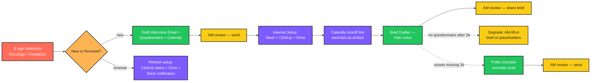
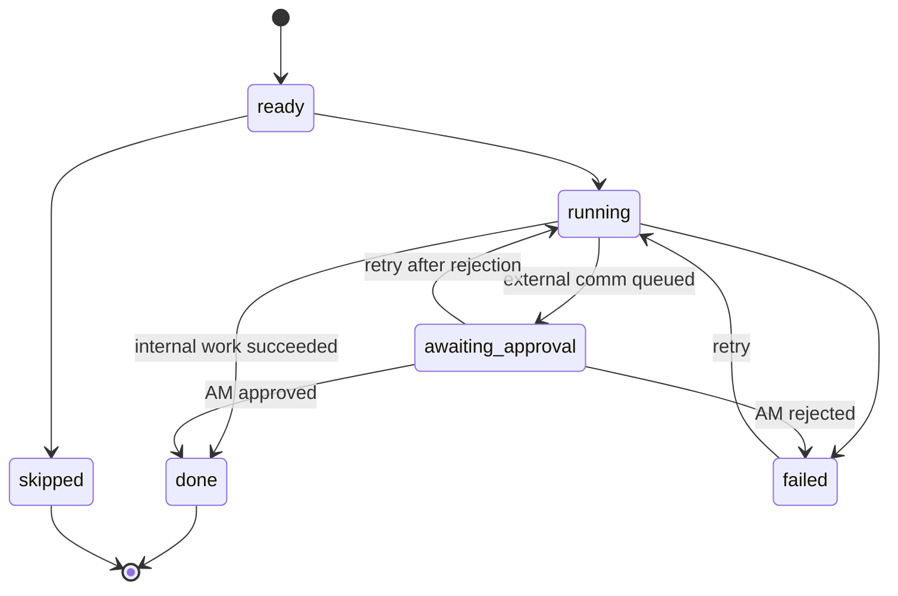

# Halo Onboarding Workflow

> Runs the full client-onboarding pipeline the moment a contract is signed — with an account manager approving every external touchpoint before it goes out.

   

---

## What it does

A new client signs a contract in DocuSign or PandaDoc. The webhook hits this service, which classifies the contract (new client vs retainer renewal), spins up the right milestones, and works through them autonomously where it's safe — Slack channel, ClickUp project, Drive folder — while queuing every external client email as a **draft** for an account manager to approve before send. If the client never fills out the questionnaire, the brief drafter gracefully degrades to an "AM fills in the blanks" template instead of inventing answers. The whole pipeline is idempotent: if a step crashes mid-flight, re-running picks up where it left off without duplicating channels, projects, or drafts.

---

## Workflow diagram



Node colour legend: **trigger** (red), **router** (orange), **internal** (purple — runs autonomously), **AI draft** (green), **AM review** (yellow — pipeline pauses here), **external** (blue).

---

## New vs renewal routing rules

Rules live in [`config/routing_rules.yaml`](config/routing_rules.yaml). They run in order; first match wins.

| Rule | Condition | Verdict |
|---|---|---|
| `explicit_renewal_field` | `contract_type == "renewal"` | **renewal** |
| `existing_client_id_present` | `existing_client_id` non-empty | **renewal** |
| `explicit_new_field` | `contract_type == "new"` | **new** |
| `subject_line_renewal_keyword` | subject contains "renewal" / "retainer renewal" / "renew" | **renewal** |
| _default_ | none of the above | **new** |

**Why default to `new`?** A misclassified renewal still has the welcome email gated by AM review — the AM catches it before it goes out. A misclassified new client (treated as renewal) would silently skip the welcome — much worse. See [`tests/test_router.py`](tests/test_router.py) and [`tests/test_renewal_safety.py`](tests/test_renewal_safety.py) for the proofs.

---

## Milestone state machine

Each milestone moves through a small set of states. Transitions are written to durable storage **before** the side effect runs, so a crash mid-step leaves a recoverable record.



Legal transitions are encoded in [`src/state/machine.py`](src/state/machine.py) — anything else throws `IllegalTransition`.

---

## Idempotency design

Every integration call is keyed by `(run_id, milestone, step)` and the result is cached in the `idempotency` table. Re-running a milestone after a crash hits the cache and returns the previous result instead of duplicating work:

```
key                                                    → result
run_abc:welcome:typeform_link                          → { form_id: TF00001, url: ... }
run_abc:welcome:calendly_link                          → { event_type_uri: ..., url: ... }
run_abc:welcome:draft_email                            → { draft_id: draft_xyz }
run_abc:welcome:queue_review                           → { review_id: rev_xyz }
run_abc:internal_setup:slack_channel                   → { channel_id: C00001, name: client-acme-branding }
run_abc:internal_setup:clickup_project                 → { project_id: CU00001, phase_count: 4 }
run_abc:internal_setup:drive_folder                    → { folder_id: DR00001, subfolder_count: 9 }
```

Combined with envelope-deduplication at the webhook layer (`store.find_run_by_envelope`), the same DocuSign callback delivered twice produces exactly one run. See [`tests/test_idempotency.py`](tests/test_idempotency.py).

---

## Degrade modes

- **Questionnaire never returned.** After `QUESTIONNAIRE_DEGRADE_DAYS` (default 3) the brief drafter switches to AM-fill-in mode — the brief is generated with `[AM TO FILL: …]` placeholders for every missing answer. The drafter **must not invent answers**; this is enforced in [`tests/test_brief_degrade.py`](tests/test_brief_degrade.py).
- **Assets missing after T+3d.** The reminder milestone emits a polite checklist email — drafted, queued for AM review, never auto-sent.
- **Slack channel collision.** Append `-2`, `-3`, …, log, continue. Up to `max_suffix` attempts (config in [`config/slack_naming.yaml`](config/slack_naming.yaml)).
- **ClickUp template missing for the service type.** Fail loud — the milestone goes to `failed`, no empty project is created.
- **Network error mid-flow.** Re-run resumes from the last successful idempotent step — no duplicate Slack channels, ClickUp projects, or Drive folders.

---

## Tech stack

| Layer | Tool |
|---|---|
| Language | Python 3.10+ |
| Web framework | FastAPI + Uvicorn |
| Validation | Pydantic v2 (`pydantic[email]`) |
| Settings | pydantic-settings (`.env`) |
| Storage | SQLite (durable; in-memory for tests) |
| HTTP client | httpx |
| Logging | structlog (JSON in prod, console in dev) |
| LLM | Anthropic Claude (`anthropic-sdk`) with offline fallback |
| E-sign | DocuSign + PandaDoc webhooks |
| Forms | Typeform |
| Scheduling | Calendly |
| Tasking | ClickUp |
| Comms | Slack |
| Storage | Google Drive |
| Tests | pytest, pytest-cov |
| Lint / format | ruff |
| Types | mypy (strict) |
| CI | GitHub Actions (Python 3.10 / 3.11 / 3.12) |

---

## Folder structure

```
.
├── src/
│   ├── app.py                    # FastAPI app factory
│   ├── __main__.py               # `python -m src` → uvicorn server
│   ├── config.py                 # Settings + .env loader
│   ├── logging_setup.py          # structlog config
│   ├── schemas.py                # Pydantic domain types
│   ├── webhook/
│   │   └── routes.py             # /webhooks/docusign, /webhooks/pandadoc
│   ├── router/
│   │   └── classifier.py         # new-vs-renewal rule engine
│   ├── milestones/
│   │   ├── orchestrator.py       # drives runs through milestone sequence
│   │   ├── welcome.py            # M1: welcome email + questionnaire + Calendly
│   │   ├── internal_setup.py     # M2: Slack + ClickUp + Drive
│   │   ├── kickoff.py            # M3: Calendly link artifact
│   │   ├── brief.py              # M4: brief draft (questionnaire OR degrade)
│   │   ├── reminder.py           # M5: polite reminder draft
│   │   └── renewal.py            # MR1: renewal refresh
│   ├── state/
│   │   ├── store.py              # SQLite-backed durable store
│   │   ├── machine.py            # legal state transitions
│   │   ├── transitions.py        # persist-then-act helper
│   │   └── idempotency.py        # @idempotent decorator + functional form
│   ├── integrations/
│   │   ├── registry.py           # IntegrationBundle of clients
│   │   ├── docusign.py           # webhook parser + HMAC verify
│   │   ├── pandadoc.py           # webhook parser + HMAC verify
│   │   ├── slack.py              # mock + real client
│   │   ├── clickup.py            # template-driven project creation
│   │   ├── drive.py              # standard + per-service folder structure
│   │   ├── calendly.py           # scheduling link
│   │   └── typeform.py           # questionnaire link + response fetch
│   ├── drafter/
│   │   ├── claude_client.py      # anthropic SDK + offline fallback
│   │   ├── offline.py            # deterministic offline templates
│   │   ├── voice.py              # Halo voice/tone system prompt
│   │   ├── welcome.py            # welcome email drafter
│   │   ├── brief.py              # project brief drafter (incl. degrade)
│   │   └── reminder.py           # polite reminder drafter
│   └── review_queue/
│       └── routes.py             # AM dashboard API
├── config/
│   ├── routing_rules.yaml        # new-vs-renewal classifier
│   ├── drive_template.yaml       # standard Drive folder set
│   ├── slack_naming.yaml         # channel naming convention
│   └── service_templates/        # per-service ClickUp + Drive shape
│       ├── branding.yaml
│       ├── web.yaml
│       ├── campaign.yaml
│       └── retainer.yaml
├── tests/                        # pytest suite (33 tests)
│   ├── fixtures/                 # contract factories + webhook payloads
│   └── ...
├── scripts/
│   └── simulate_webhook.py       # local webhook-event simulator
├── .github/workflows/ci.yml      # GitHub Actions
├── .env.example                  # all env vars documented
├── pyproject.toml                # ruff + mypy + pytest config
├── requirements.txt              # runtime deps
└── requirements-dev.txt          # + ruff + mypy + pytest
```

---

## Setup

```bash
# 1. Clone + venv
git clone <repo>
cd halo-onboarding
python -m venv .venv
source .venv/bin/activate                # Windows: .venv\Scripts\activate

# 2. Install
pip install -r requirements-dev.txt

# 3. Copy env template
cp .env.example .env                     # Windows: copy .env.example .env

# 4. Run the test suite (33 tests, ~3s)
pytest

# 5. Start the server (mock mode — no credentials required)
python -m src                            # → http://127.0.0.1:8000
# Open http://127.0.0.1:8000/docs for the Swagger UI
```

### Real-integration setup (optional)

The default `MOCK_INTEGRATIONS=true` runs the whole pipeline in-process with no external calls. To wire a real provider:

| Provider | Steps |
|---|---|
| **DocuSign** | In DocuSign Admin → Connect, create a webhook pointing at `https://<your-host>/webhooks/docusign`. Set the HMAC secret and copy it to `DOCUSIGN_WEBHOOK_SECRET`. |
| **PandaDoc** | Settings → Integrations → Webhooks. Same idea: secret goes in `PANDADOC_WEBHOOK_SECRET`. |
| **Typeform** | Create a personal token → `TYPEFORM_API_TOKEN`. |
| **Calendly** | Generate an OAuth or PAT token → `CALENDLY_API_TOKEN`. Copy the kickoff event-type URI → `CALENDLY_EVENT_TYPE_URI`. |
| **ClickUp** | Personal API token → `CLICKUP_API_TOKEN`. Workspace ID → `CLICKUP_WORKSPACE_ID`. |
| **Slack** | Create a Slack app, install to the workspace with scopes `channels:manage channels:write.invites chat:write`. Bot token → `SLACK_BOT_TOKEN`. |
| **Google Drive** | OAuth service-account JSON path → `GOOGLE_DRIVE_CREDENTIALS_PATH`. Parent folder ID → `GOOGLE_DRIVE_PARENT_FOLDER_ID`. |
| **Claude** | `ANTHROPIC_API_KEY` enables live drafts; without it, the deterministic offline fallback runs (still in Halo's voice). |

Once a credential is present **and** `MOCK_INTEGRATIONS=false`, the corresponding `Real*Client` is wired in. The protocols are already in place; the real-client method bodies have `NotImplementedError` placeholders pointing at the exact API endpoint to call — fill them in as you turn on each integration.

---

## Environment variables

| Variable | Default | Purpose |
|---|---|---|
| `APP_ENV` | `development` | Switches log formatter between console and JSON |
| `LOG_LEVEL` | `INFO` | structlog level |
| `DATABASE_URL` | `sqlite:///./data/onboarding.db` | Use `sqlite:///:memory:` for tests |
| `MOCK_INTEGRATIONS` | `true` | When true, all external calls use deterministic fakes |
| `QUESTIONNAIRE_DEGRADE_DAYS` | `3` | T+N days with no questionnaire → AM-fill-in mode |
| `REMINDER_DAYS` | `3` | T+N days with missing assets → reminder draft |
| `DOCUSIGN_WEBHOOK_SECRET` | `replace-me` | HMAC secret for DocuSign Connect |
| `PANDADOC_WEBHOOK_SECRET` | `replace-me` | HMAC secret for PandaDoc webhooks |
| `TYPEFORM_API_TOKEN` | `""` | Live Typeform — leave blank in mock mode |
| `CALENDLY_API_TOKEN` | `""` | Live Calendly |
| `CALENDLY_EVENT_TYPE_URI` | `""` | The specific kickoff event type to book against |
| `CLICKUP_API_TOKEN` | `""` | Live ClickUp |
| `CLICKUP_WORKSPACE_ID` | `""` | Workspace under which to create projects |
| `SLACK_BOT_TOKEN` | `""` | `xoxb-…` bot token |
| `GOOGLE_DRIVE_CREDENTIALS_PATH` | `""` | Path to service-account JSON |
| `GOOGLE_DRIVE_PARENT_FOLDER_ID` | `""` | Parent folder under which client folders are created |
| `ANTHROPIC_API_KEY` | `""` | Enables live Claude drafting |
| `ANTHROPIC_MODEL` | `claude-opus-4-7` | Model used for drafting |
| `AGENCY_NAME` | `Halo Brand Studio` | Used in draft signatures |
| `AGENCY_DOMAIN` | `halo.studio` | Used in draft signatures |
| `SLACK_CHANNEL_PREFIX` | `client` | Channel naming: `{prefix}-{slug}-{service}` |

---

## Configuration

### Service-type templates ([`config/service_templates/`](config/service_templates/))

Each YAML file defines the ClickUp phases / tasks AND the Drive subfolder structure for a service type. To add a new service: drop a `<name>.yaml` in the directory matching the same schema as `branding.yaml`, add the matching value to `ServiceType` in [`src/schemas.py`](src/schemas.py).

### Slack naming ([`config/slack_naming.yaml`](config/slack_naming.yaml))

`{prefix}-{client-slug}-{service-type}`, lowercase, hyphens, alnum only. On collision, append `-2`, `-3`, … up to `max_suffix` attempts.

### Drive template ([`config/drive_template.yaml`](config/drive_template.yaml))

Standard folders every client gets (`00_Contracts`, `01_Brand_Inputs`, …) — merged with per-service phase folders, deduped.

---

## Running locally — simulate a webhook

With the server running on `127.0.0.1:8000`:

```bash
# New-client DocuSign envelope
python scripts/simulate_webhook.py docusign new

# Retainer-renewal PandaDoc envelope
python scripts/simulate_webhook.py pandadoc renewal
```

Then poke around the AM dashboard endpoints:

```bash
curl http://127.0.0.1:8000/runs                    # list runs
curl http://127.0.0.1:8000/runs/<run_id>           # one run + drafts + reviews
curl http://127.0.0.1:8000/reviews                 # pending AM reviews
curl -X POST http://127.0.0.1:8000/reviews/<id>/approve \
  -H 'Content-Type: application/json' \
  -d '{"reviewer_email": "priya@halo.studio"}'
```

Or, for the full Swagger UI: <http://127.0.0.1:8000/docs>.

---

## Troubleshooting

| Symptom | Likely cause | Fix |
|---|---|---|
| `WebhookSignatureError: missing docusign signature header` | Webhook request didn't include the HMAC header | Check Connect / PandaDoc settings — make sure HMAC is enabled and the secret matches `.env` |
| `WebhookSignatureError: docusign signature mismatch` | Secret mismatch between sender and `.env` | Re-copy the secret; the verifier uses `hmac.compare_digest` so a stray newline matters |
| `TemplateMissingError: no ClickUp template configured for service_type='xyz'` | New service type added without a template | Add `config/service_templates/xyz.yaml` |
| `IllegalTransition: ready → done` | Code tried to skip the `running` state | Use `state.transitions.transition()` — never assign `m.state` by hand |
| Brief comes out empty / generic | No questionnaire AND no AM-provided answers yet | Brief drafter inserts `[AM TO FILL: …]` placeholders — fill them in the AM dashboard before approving |
| Slack channel name conflict on rerun | Collision-resolution kicked in | Look at the run's `internal_setup.artifacts.slack.channel_name` — `-2` / `-3` suffix is expected |
| Run stuck `awaiting_approval` | AM hasn't decided yet | Hit `POST /reviews/{id}/approve` or `/reject` |

---

## Tests

```bash
pytest                              # 33 tests, ~3s
pytest -k renewal                   # just renewal-safety
pytest --cov=src --cov-report=term  # with coverage
```

The required-by-CLAUDE.md tests are all present and passing:

- ✅ `tests/test_renewal_safety.py` — renewal contracts never trigger welcome email
- ✅ `tests/test_idempotency.py` — rerun does not duplicate Slack/ClickUp/Drive
- ✅ `tests/test_brief_degrade.py` — no questionnaire after 3d → AM-fill-in template, never invents
- ✅ `tests/test_external_email_gating.py` — external client emails gated by AM approval state

---

## License

MIT.
